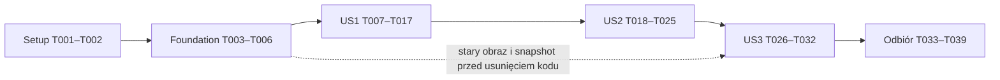

# Tasks: Usunięcie wycofanych funkcji i materiałów projektowych

**Input**: Dokumenty w `specs/007-remove-retired-features/`
**Prerequisites**: [plan.md](plan.md), [spec.md](spec.md), [research.md](research.md),
[data-model.md](data-model.md), [contracts/retirement.md](contracts/retirement.md),
[contracts/removal-inventory.md](contracts/removal-inventory.md), [quickstart.md](quickstart.md)
**Branch**: `cleanup`; identyfikator funkcji niezależny od nazwy gałęzi.
**Tests**: Obowiązkowe TDD zgodnie z konstytucją v2.0.0 i FR-014/FR-015.
**Organization**: Trzy historie P1; każda ma własne kryterium odbioru.
**Status**: Wszystkie 39 zadań wykonano i zweryfikowano lokalnie. Produkcja nie została wdrożona.

## Format: `[ID] [P?] [Story] Description`

- `[P]` oznacza możliwość równoległej pracy wyłącznie po spełnieniu zależności danej fazy.
  Nie oznacza automatycznego uruchamiania dodatkowych agentów.
- `[US1]`, `[US2]`, `[US3]` odpowiadają historiom ze specyfikacji.
- Raport `specs/007-remove-retired-features/validation.md` powstanie w T001; zawiera
  tylko wyniki i metadane, bez sekretów, prywatnych ścieżek produkcji czy treści rozmów.
- Test zmienianego zachowania musi najpierw wykazać oczekiwaną porażkę.
  Testy zachowania niezmienianych funkcji i danych mogą przechodzić już w baseline.
  Błąd narzędzia lub połączenia nie jest wynikiem red dla wymagania.

## Path Conventions

Ścieżki w zadaniach są względne do repozytorium: `frontend/`, `tablechart/`, `scrapper/`.
Pomocnicze testy HTTP/upgrade umieścić w `tests/retirement/`; służą wyłącznie weryfikacji,
nie tworzą nowej funkcji aplikacji. Jeżeli potrzebują fixtures, używać wyłącznie danych
syntetycznych w `tests/retirement/fixtures/` oraz tymczasowych kopii poza produkcją.
Prywatne archiwum pozostaje poza repozytorium, obrazami i publicznymi katalogami.

## Phase 1: Setup (Shared Infrastructure)

**Purpose**: Ustalenie stanu roboczego i odtwarzalnego środowiska bez zmiany aplikacji.

- [X] T001 Zweryfikować Git, gałąź `cleanup` i istniejące zmiany bez resetowania pracy użytkownika; utworzyć raport z sekcjami baseline/red/green/coverage/UI/archive/rollback w `specs/007-remove-retired-features/validation.md`.
- [X] T002 Przygotować izolowany host lub kontekst Docker oraz testowe ustawienia według `specs/007-remove-retired-features/quickstart.md`; zapisać wersje, identyfikatory starych obrazów, bazowe wyniki testów i buildów oraz ich rozmiary w `specs/007-remove-retired-features/validation.md`; uwzględnić stałe nazwy kontenerów i port 8008 z `docker-compose.yml`.

## Phase 2: Foundational (Blocking Prerequisites)

**Purpose**: Wspólne zabezpieczenia danych i zestaw kontrolny przed usuwaniem.

- [X] T003 Zweryfikować aktualny zakres usunięć i współdzielone importy według `specs/007-remove-retired-features/contracts/removal-inventory.md`; potwierdzić brak migracyjnych zależności innych aplikacji od `tablechart/chatbot_app/migrations/0001_initial.py` i nie rozszerzać zakresu na niezależne legacy.
- [X] T004 Przygotować w `tests/retirement/fixtures/` syntetyczne rozmowy, wiadomości, CSV, darczyńców i pomiary oraz scenariusz upgrade w `tests/retirement/test_archive_upgrade.py`; przed usunięciem starego kodu utworzyć izolowaną bazę poprzednią wersją i zapisać kontrolny stan zgodnie z `specs/007-remove-retired-features/data-model.md`: „session_id unikalny”, „FK do Conversation; dotychczasowe CASCADE przy usunięciu rozmowy”; nie zmieniać ograniczeń, kluczy ani timestampów.
- [X] T005 Przećwiczyć na starym kontenerze testowym procedurę obecność/brak plików `/app/logs/chat_history.csv`, `/logs/chat_history.csv` oraz dawnej ścieżki darczyńców z `specs/007-remove-retired-features/quickstart.md`; zabezpieczyć nietrwałe pliki w nowym prywatnym miejscu i porównać rozmiar/SHA-256 przed odtworzeniem kontenera; wynik bez treści danych zapisać w `specs/007-remove-retired-features/validation.md`.
- [X] T006 Uzupełnić regresje aktywnych endpointów w `tablechart/chart_app/tests.py`: aktualne i historyczne dane, dostępne daty, pogoda, sesja brak/niedopasowana/poprawna, cookie CSRF; uruchomić baseline oraz istniejące `frontend/src/tests/Theme.test.jsx` i `frontend/src/tests/LoadingStates.test.jsx`, z kontrolowanymi danymi i podmienionymi usługami zewnętrznymi.

**Checkpoint**: Zachowany materiał do porównania upgrade, sprawdzone zabezpieczanie plików,
znane bazowe wyniki. Nie ma zgody na usuwanie tabel, plików użytkownika lub wolumenów.
Nie zaczynać usuwania przed zakończeniem T001–T006.

## Phase 3: User Story 1 - Aktualny produkt bez wycofanych funkcji (Priority: P1)

**Goal**: Wycofane wejścia przestają działać; aktywne widoki i motywy pozostają dostępne.

**Independent Test**: Dawne adresy dają publiczne 410 oraz backendowe/dev 404, bez 200 SPA
i bez wywołań dostawcy; aktywne dashboard, data, średnie, szczegóły i motywy przechodzą regresje.

### Tests for User Story 1 (TDD)

- [X] T007 [P] [US1] Dodać w `tablechart/chart_app/tests.py` testy oczekujące braku rejestracji chatbota i 404 dla `/chatbot`, `/chatbot/`, `/chatbot/api/chat/` przy GET/POST/HEAD, z dawnymi ustawieniami obecnymi i nieobecnymi; zablokować realny kontakt z dostawcą i sprawdzić brak zapisu wiadomości.
- [X] T008 [P] [US1] Dodać w `frontend/src/tests/Retirement.test.jsx` testy braku eksportu klienta chatbota i elementów wycofanych funkcji w aktywnych widokach; zachować scenariusze aktywnej nawigacji, motywów, prawdziwego zera, braku danych i błędu odświeżenia bez zmiany oczekiwanych wartości pomiarów.
- [X] T009 [P] [US1] Przygotować w `tests/retirement/test_http_retirement.py` uruchamialne testy kontraktu `specs/007-remove-retired-features/contracts/retirement.md`: Nginx 410 i polski JSON/no-store, Django i Vite 404; exact/prefix, query, suffix .js, GET/POST/HEAD/OPTIONS, kontrolny `/chatbot-other`; przy braku backendu dev nie może zwracać 2xx.
- [X] T010 [US1] Uruchomić T007–T009 przed zmianą implementacji i zapisać oczekiwane porażki oraz przechodzące regresje w `specs/007-remove-retired-features/validation.md`; żaden test nie może używać prawdziwego klucza modelu ani produkcyjnych danych.

### Implementation for User Story 1

- [X] T011 [US1] Usunąć rejestrację `chatbot_app` z `tablechart/tablechart/settings.py` i jego include z `tablechart/tablechart/urls.py`; zachować sesje, middleware CSRF, aktywną aplikację i endpointy basenowe; bez dodawania widoku zastępczego.
- [X] T012 [US1] Usunąć wyłącznie kod katalogu `tablechart/chatbot_app/`, wraz z migracją źródłową, po sprawdzeniu absolutnej ścieżki w repo; nie wykonywać DeleteModel, DROP TABLE, `migrate chatbot_app zero`, czyszczenia content types ani rekordów migracji.
- [X] T013 [P] [US1] Usunąć `frontend/src/components/ChatbotWidget.jsx` oraz `sendChatMessage` i używany wyłącznie przez nią `getCsrfToken` z `frontend/src/services/api.js`; zachować pozostałe funkcje fetch i aktualne zabezpieczenia po stronie serwera.
- [X] T014 [P] [US1] Usunąć `tablechart/static/assets/js/chatbot-widget.js` i `tablechart/static/assets/css/chatbot-widget.css` oraz znalezione odwołania wyłączne; zachować wspólne zasoby i nie czyścić dawnego localStorage użytkowników.
- [X] T015 [P] [US1] Zastąpić proxy chatbota w `frontend/nginx.conf` odpowiedzią 410 dla exact `/chatbot` i `^~ /chatbot/` zgodnie z kontraktem, z polskim JSON, właściwym Content-Type i no-store; reguła ma wyprzedzać SPA i regex zasobów statycznych.
- [X] T016 [P] [US1] W `frontend/vite.config.js` zachować wąskie przekazanie dawnych adresów do backendowego 404 jako udokumentowane zabezpieczenie przed fallbackiem SPA; sprawdzić zachowanie prefiksu i `/chatbot-other`, zawężając dopasowanie jeśli test kontraktu tego wymaga.
- [X] T017 [US1] Uruchomić ponownie testy US1 oraz aktywne regresje po T011–T016 i zapisać green oraz dowód braku nowych wywołań dostawcy w `specs/007-remove-retired-features/validation.md`; użyć `tests/retirement/test_http_retirement.py` do kontroli wszystkich trzech wejść.

**Checkpoint**: US1 można zademonstrować na izolowanym środowisku.
To jeszcze nie pełne wydanie: US2 usuwa zależności, a US3 potwierdza archiwum.

## Phase 4: User Story 2 - Utrzymanie bez zbędnych zależności (Priority: P1)

**Goal**: Projekt działa bez wycofanych pakietów, ustawień i makiet.

**Independent Test**: Świeży build/start bez konfiguracji wycofanych funkcji, działające
pomiary i motywy, brak makiet i nieuzasadnionych pozostałości w utrzymywanym kodzie.

### Tests for User Story 2 (TDD)

- [X] T018 [US2] Przygotować w `tests/retirement/test_runtime_retirement.py` kontrolę świeżego obrazu bez pakietów wycofanych funkcji oraz startu backendu bez ich ustawień; dodać odbiór builda bez `rework/` i `darkmode/`; sprawdzić wymagania `tablechart/requirements.txt` i obraz, a nie wyłącznie stare środowisko z zainstalowanymi bibliotekami.
- [X] T019 [US2] Uruchomić kontrolę T018 przed sprzątaniem deklaracji i zapisać oczekiwane red dla pozostałych wycofanych zależności/ustawień w `specs/007-remove-retired-features/validation.md`; nie traktować niedostępnego registry jako oczekiwanej porażki testu.

### Implementation for User Story 2

- [X] T020 [P] [US2] Usunąć `langchain`, `langchain-google-genai`, `pydantic`, `bleach` i nieużywany `qdrant-client` z `tablechart/requirements.txt` po ponownej kontroli importów; zachować `django-ratelimit`, pandas, requests, pytz i pozostałe aktywne zależności bez zbiorczego upgrade.
- [X] T021 [P] [US2] Usunąć GEMINI_API_KEY, DONATION_LIST_PATH, GODMODE_EMAIL i BUYCOFFEE_URL z `tablechart/tablechart/settings.py`, `.env.example` i `tablechart/.env.example`; ustalić status `tablechart/.env example` i oczyścić wyłącznie utrzymywany przykład, bez wyświetlania wartości lub modyfikowania prywatnych .env.
- [X] T022 [P] [US2] Usunąć `rework/` i `darkmode/` po sprawdzeniu, że ich absolutne ścieżki są wewnątrz repozytorium; usunąć tylko wyłączne odwołania, zachowując `frontend/src/contexts/ThemeContext.jsx`, `frontend/src/components/DarkModeToggle.jsx`, `frontend/src/theme.css`, współdzielone zasoby i licencje.
- [X] T023 [P] [US2] Zaktualizować `README.md` o aktualny produkt i pięć usług, usunąć instrukcje chatbota/darczyńców oraz wymagania ich kluczy; zachować historyczne specyfikacje i nie opisywać archiwów jako skasowanych.
- [X] T024 [US2] Przeszukać utrzymywany kod i konfigurację zgodnie z `specs/007-remove-retired-features/contracts/removal-inventory.md`; przypisać każdej pozostałości usunięcie albo uzasadniony wyjątek, w tym regułę Vite, ochronę archiwów i historyczne materiały; nie otwierać treści prywatnych plików ani vendorowych danych.
- [X] T025 [US2] Po T020–T024 wykonać kontrolę świeżego runtime z `tests/retirement/test_runtime_retirement.py`, frontendowy build i testy oraz `scrapper/tests/test_db_handler.py`; zapisać wyniki i ewentualne skipy w `specs/007-remove-retired-features/validation.md`, uruchamiając transakcje DB przy zmianie wspólnych zależności bazodanowych.

**Checkpoint**: Start i build nie wymagają wycofanych zależności, ustawień ani materiałów.
Brak wzmianki w aktywnym interfejsie nie zastępuje kontroli artefaktów runtime.

## Phase 5: User Story 3 - Zachowanie danych poza aktywną aplikacją (Priority: P1)

**Goal**: Dawne dane pozostają nieaktywne i prywatne, aktualizacja nie niszczy danych.

**Independent Test**: Czysty start i aktualizacja ze starymi syntetycznymi danymi,
zgodność zawartości przed/po, brak dostępu aplikacji do archiwum i brak danych w obrazie.

### Tests for User Story 3 (TDD)

- [X] T026 [US3] Dodać w `tests/retirement/test_archive_packaging.py` test obrazu z syntetycznymi donors.json i logs/chat_history.csv w izolowanej kopii build context; sprawdzić, że dane nie trafiają do nowego obrazu, i zapisać oczekiwane red przed zmianą `tablechart/.dockerignore`; nie dodawać prawdziwych danych do kontekstu.

### Implementation for User Story 3

- [X] T027 [US3] Uzupełnić `tablechart/.dockerignore` o donors.json, logs/, archiwa i nietypowe prywatne pliki środowiskowe według wykazu; zachować odpowiednie reguły `.gitignore`; nie usuwać plików źródłowych użytkownika i uzyskać green testu T026.
- [X] T028 [US3] Uzupełnić `README.md` i `specs/007-remove-retired-features/quickstart.md` o ostateczną procedurę archiwum: kontrola obu ścieżek CSV, prywatny manifest lokalizacji, kopia nietrwałych plików przed odtworzeniem kontenera, zgodność hashów i brak automatycznego kasowania; wskazać, że istniejące tabele, migration records i wolumeny pozostają.
- [X] T029 [US3] Na nowej izolowanej bazie uruchomić zwykłe migrate i odbiór clean-start z `tests/retirement/test_archive_upgrade.py`; potwierdzić brak nowo utworzonych tabel/plików chatbota i działanie aktywnych endpointów, a wynik zapisać w `specs/007-remove-retired-features/validation.md`.
- [X] T030 [US3] Na kopii przygotowanej w T004 wykonać upgrade i ponowne uruchomienie z `tests/retirement/test_archive_upgrade.py`; porównać treść/liczby rekordów, klucze, timestampy oraz hash/rozmiar plików, sprawdzić brak operacji kasujących i zapytań aktywnej aplikacji do archiwum oraz niezmienione pomiary; zapisać zanonimizowany wynik w `specs/007-remove-retired-features/validation.md`.
- [X] T031 [US3] Przećwiczyć na izolowanych danych rollback według `specs/007-remove-retired-features/contracts/retirement.md`, używając obrazu naprawczego ze starym kodem basenowym, nadal bez rejestracji chatbota i jego poświadczeń; potwierdzić zachowanie danych i odrzucanie dawnych wejść również bezpośrednio w backendzie.
- [X] T032 [US3] Zamknąć sekcję archiwum w `specs/007-remove-retired-features/validation.md`: wariant dane obecne/brak, wykluczenie z obrazów i publicznych ścieżek, zgodność przed/po oraz manifest pozostający u opiekuna; oznaczyć prywatne dane jako zachowane do osobnej decyzji, nie jako usunięte.

**Checkpoint**: US3 jest odebrane dopiero po dowodach clean/upgrade/ponowny start/rollback.
Sama deklaracja braku migracji kasującej nie wystarcza.

## Phase 6: Polish & Cross-Cutting Concerns

**Purpose**: Odbiór całości, dokumentacja i gotowość do PR/wydania.

- [X] T033 Uruchomić pełny właściwy zestaw testów Django/Vitest/scrapera według `specs/007-remove-retired-features/quickstart.md`; zapisać raport nowych wykonywalnych linii per runtime i minimum 80% ich pokrycia w `specs/007-remove-retired-features/validation.md`, albo udokumentować ich brak; niewykonane kontrole i skipy pozostawić jawne.
- [X] T034 Sprawdzić świeże obrazy, `docker-compose.yml` przez config --quiet oraz `frontend/nginx.conf` przez nginx -t; ponowić cały kontrakt `tests/retirement/test_http_retirement.py` z dawnymi fikcyjnymi ustawieniami i bez nich, zapisując wyniki w `specs/007-remove-retired-features/validation.md`.
- [X] T035 Wykonać macierz UI z `specs/007-remove-retired-features/quickstart.md`: telefon/desktop, oba motywy, klawiatura; dashboard, data, średnie, szczegóły, pogoda, informacje dodatkowe, błędy/brak danych/zero; porównać kontrolne wartości i zapisać wynik w `specs/007-remove-retired-features/validation.md`.
- [X] T036 Zweryfikować końcowy diff i zamknąć każdy wpis `specs/007-remove-retired-features/contracts/removal-inventory.md`; potwierdzić, że `docker-compose.yml`, schemat/pomiary, historyczne specs, prywatne .env, archiwa i backupy nie zostały zmienione poza autoryzowanym zakresem.
- [X] T037 Porównać z baseline rozmiary builda frontendowego i obrazu backendu oraz liczbę żądań aktywnych scenariuszy; zapisać wynik w `specs/007-remove-retired-features/validation.md`; przy istotnym wpływie na krytyczną ścieżkę najpierw doprecyzować budżet w `specs/007-remove-retired-features/spec.md`, bez deklarowania niezmierzonego przyspieszenia.
- [X] T038 Uzupełnić checklistę wydania w `specs/007-remove-retired-features/quickstart.md`: identyfikacja starego obrazu, blokada zapisów wycofanych funkcji, zabezpieczenie faktycznych plików przed odtworzeniem kontenera, migracje bez kasowania, smoke po wydaniu i kontrolowany rollback; przećwiczyć ją na izolowanym środowisku.
- [X] T039 Przygotować opis PR oparty na `specs/007-remove-retired-features/validation.md`, z zakresem, dowodami, zachowanymi wyjątkami i procedurą wydania; uaktualnić wyłącznie naprawdę wykonane checkboxy w `specs/007-remove-retired-features/tasks.md`; nie oznaczać wdrożenia produkcyjnego jako wykonanego na podstawie prób lokalnych.

**Checkpoint**: Funkcja gotowa do przeglądu i wydania. Rzeczywiste wydanie produkcyjne
nie jest wykonywane przez tę listę zadań implementacyjnych; przed nim opiekun powtarza
kontrole rzeczywistych archiwów. Harmonogram codziennych backupów i próg świeżości
pozostają odrębnym zakresem.

## Dependencies & Execution Order

### Phase Dependencies

Kolejność jest celowo sekwencyjna dla zmian współdzielonych. Wszystkie historie mają P1.
Każdą można sprawdzić oddzielnym zestawem scenariuszy, lecz pełne wydanie wymaga wszystkich
trzech: samo US1 nie zapewnia usunięcia zależności ani końcowego dowodu zachowania danych.

### Within Each User Story

- T001 → T002 → T003 → T004 → T005 → T006.
- US1: T007/T008/T009 mogą powstawać równolegle; T010 zbiera red.
  Następnie T011 → T012; po nich T013/T014/T015/T016 mogą być wykonane równolegle;
  T017 czeka na wszystkie zmiany.
- US2: po T017 wykonać T018 → T019; T020/T021/T022/T023 mogą działać równolegle.
  T024 wymaga ich zakończenia, T025 zamyka odbiór.
- US3: T026 → T027 → T028 → T029 → T030 → T031 → T032.
  T029 i T030 używają różnych stanów bazy; nie współdzielić aktywnego zestawu danych.
- Odbiór: T033 → T034 → T035 → T036 → T037 → T038 → T039.
- T004/T005 zawsze poprzedzają odtworzenie jakiegokolwiek starego środowiska
  z potencjalnymi danymi; nie odkładać zabezpieczenia CSV do końcowego odbioru.

### Parallel Example: User Story 1

Po fundamentach: T007 (`tablechart/chart_app/tests.py`), T008
(`frontend/src/tests/Retirement.test.jsx`) i T009
(`tests/retirement/test_http_retirement.py`) nie edytują wspólnych plików.
Uruchomienie HTTP czeka na kontrolowany runtime; nie rekonfigurować w tym czasie usług
używanych przez drugi test.

### Parallel Example: User Story 2

Po red T019: T020 (`tablechart/requirements.txt`), T021 (ustawienia/przykłady),
T022 (makiety) i T023 (`README.md`) są rozłączne. Build i kontrola green czekają na całość.
Wspólny raport aktualizować dopiero przy T025, aby uniknąć równoległych edycji.

### Parallel Example: User Story 3

Brak zalecanej równoległości wewnątrz tej historii: packaging red musi poprzedzić
wykluczenia, a clean/upgrade/rollback wymagają kontrolowanych stanów środowiska.
Nie oznaczać tych zadań `[P]` tylko dlatego, że część z nich dotyczy dokumentacji.

## Requirement Traceability

| Wymagania | Zadania |
|---|---|
| FR-001, FR-002, FR-003 | T003, T007–T017, T021–T022, T034 |
| FR-004, FR-005, FR-006 | T003, T018–T025, T027, T036 |
| FR-007 | T008, T022, T025, T035 |
| FR-008, FR-009 | T006, T008, T017, T025, T033–T035 |
| FR-010, FR-011, FR-012 | T004–T005, T012, T026–T032 |
| FR-013 | T023, T028, T038 |
| FR-014, FR-015, FR-016 | T006–T010, T018–T019, T026, T033–T035, T039 |
| FR-017 | T003, T024, T032, T036–T037 |
| FR-018 | T031, T038–T039 |
| SC-001 | T017, T034 |
| SC-002 | T006, T017, T035 |
| SC-003, SC-004 | T025, T036 |
| SC-005, SC-006 | T029–T032, T038 |

## Implementation Strategy

### MVP First

Najmniejszy demonstracyjny zakres: setup + fundamenty + US1 (T001–T017).
Daje rzeczywiste odrzucanie dawnych wejść i zachowanie aktywnego produktu na środowisku
testowym. Produkcyjny zakres minimalny obejmuje również US2, US3 i odbiór danych.

### Incremental Delivery

1. Baseline, stan danych i testy przed usuwaniem.
2. US1: usunięcie wykonywania funkcji i ochrona aktywnych zachowań.
3. US2: wycofanie zależności, konfiguracji i makiet.
4. US3: dowody zachowania archiwów, czystego startu i aktualizacji.
5. Odbiór całości i przygotowanie PR/wydania.

### Notes

- Nie dodawać nowej obsługi archiwum ani migracji kasujących dane.
- Testy negatywne nie mogą wysyłać rzeczywistych wiadomości do dostawcy.
- Podczas rekursywnego usuwania zweryfikować absolutny cel wewnątrz repozytorium
  i wykonać operację w jednej powłoce z literalnymi ścieżkami.
- Braki narzędzi i niezaliczone kontrole raportować; nie zamieniać ich w checkboxy wykonane.
- Ta lista nie zmienia istniejących decyzji o zachowaniu danych ani o wycofaniu funkcji.

